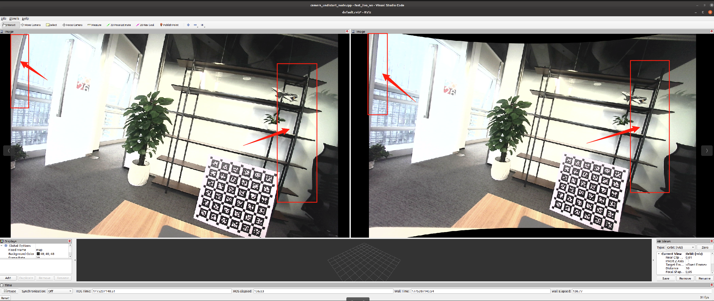

### 该ROS功能包，主要是将配置好的相机内参和相机（广角）原始图像处理，获取校正后的图像

##### 系统：Ubuntu20.04 ROS Noetic

###### 配置参数介绍：

config/camera_intrinsics.yaml:配置标定后的相机内参（建议用Kalibr标定）

内容：

camera_undistort_node

      input_topic: "/usb_cam/image_raw"   // 输入的原始图像topic（带畸变的相机图像）
  
      output_topic: "/usb_cam/image_rect" // 输出的去畸变后的图像topic
      
      output_camera_info_topic: "/usb_cam/camera_info_rect"  // 输出的去畸变后的相机内参信息（camera_info）

      
      image_width: 1920             // 相机分辨率（必须与标定时一致）
      
      image_height: 1200

      
      fx: 750.6022573008312    // x方向焦距（单位：像素）

      
      fy: 752.160192071341     // y方向焦距（单位：像素）

      
      cx: 959.2247459250367    // 主点x坐标（光心位置）

      
      cy: 581.7438043416802    // 主点y坐标（光心位置）

     
      dist_coeffs: [0.3513712123496613,               //  广角/鱼眼 模型的畸变参数（equidistant模型) 对应 Kalibr 的 distortion_coeffs: [k1, k2, k3, k4]
                    0.17902195708944021, 
                   -0.28688916527785197, 
                    0.11284247068393805]

       balance: 1.0                                  // 去畸变后视场保留比例（类似 OpenCV fisheye 的 balance）取值范围： 0 完全去畸变（裁剪掉边缘黑区，视野最小） 1 保留全部视野（可能出现黑边）
       use_same_k_for_output: false                  // 是否使用原始K作为输出K矩阵 ,默认 false:输出新的K矩阵（推荐）与rect图像严格匹配
                    
